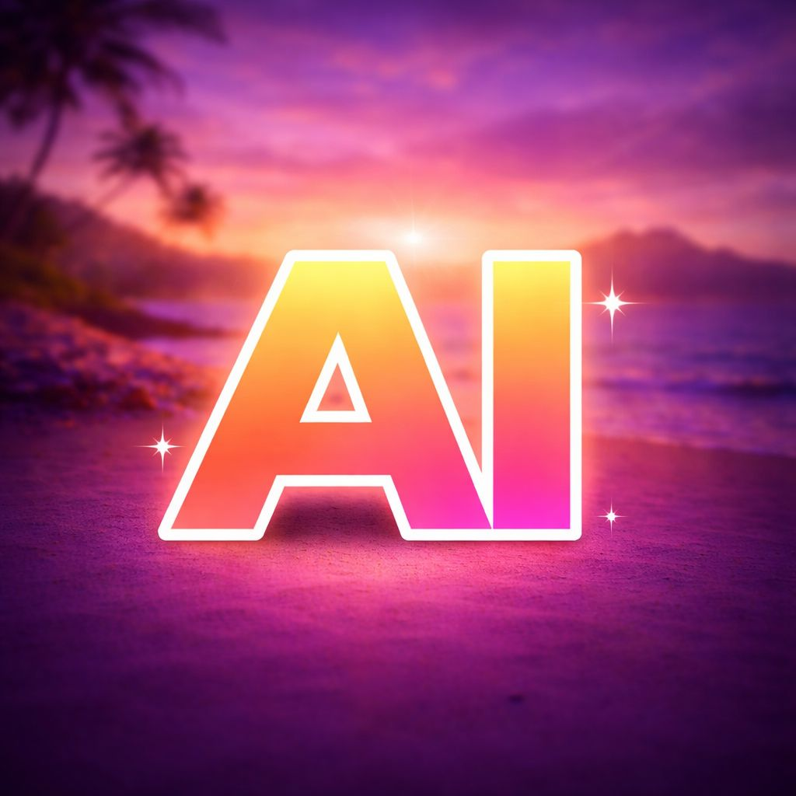
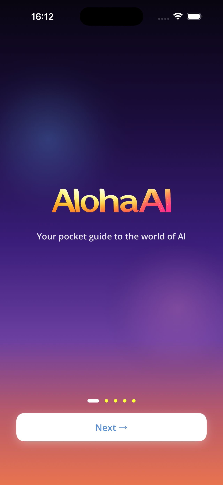
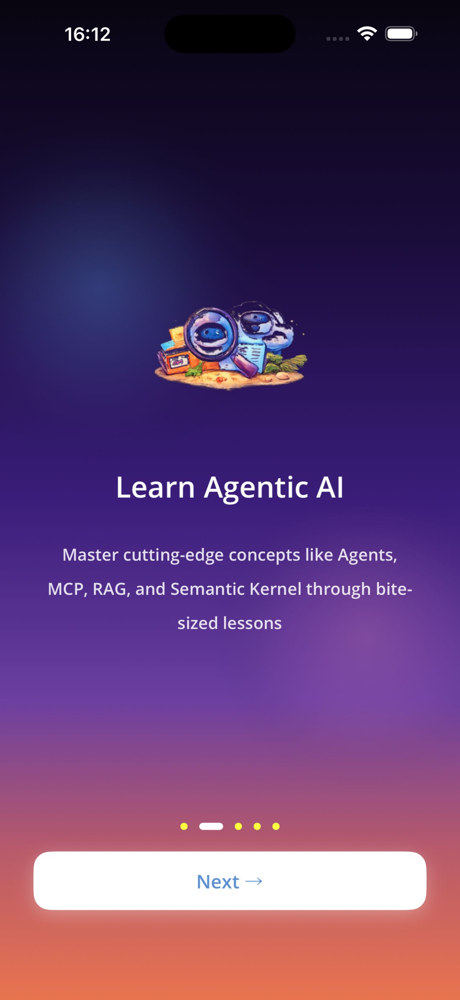
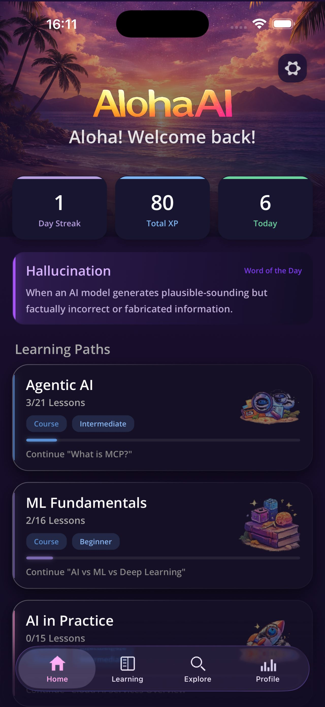
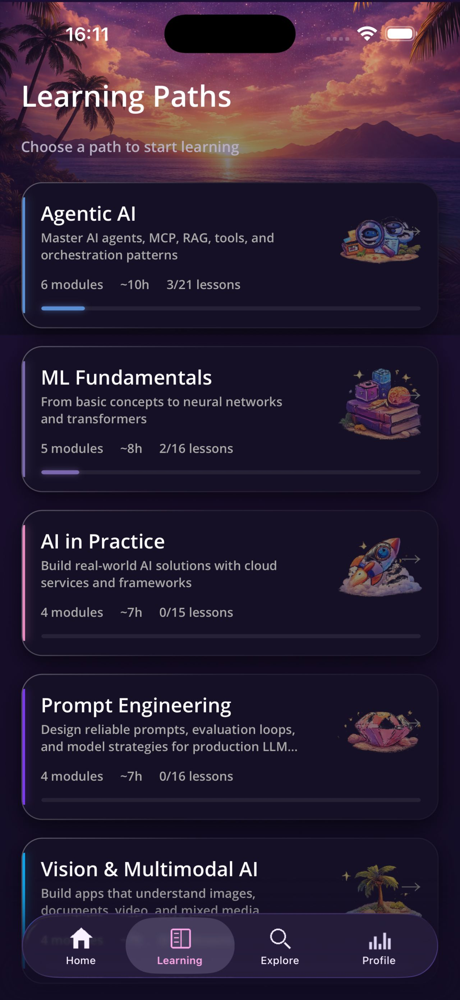
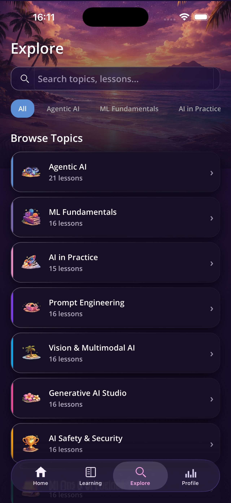
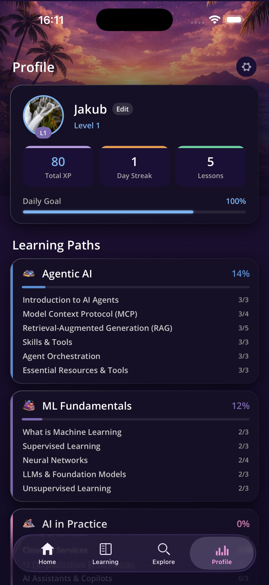
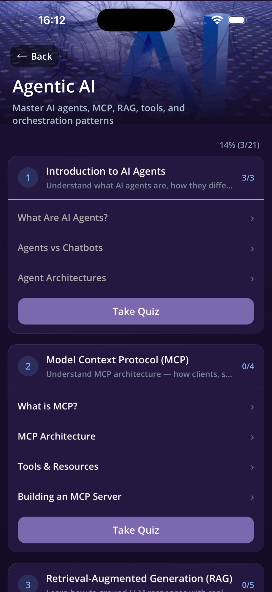
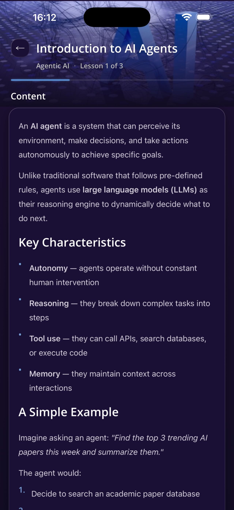
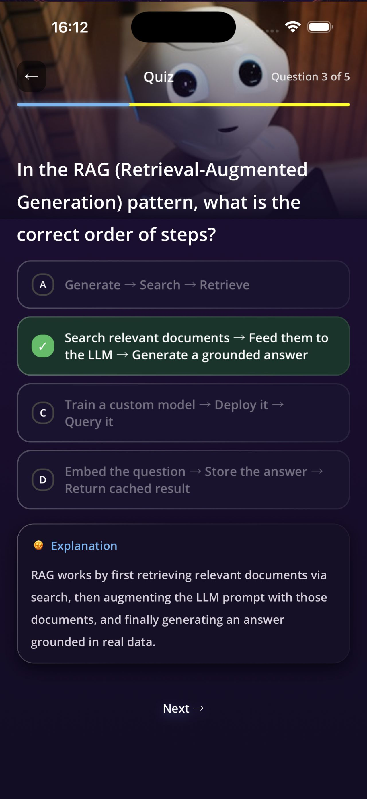

<p align="center">
  
</p>

<h1 align="center">🌺 AlohaAI</h1>

<p align="center">
  <strong>Your pocket guide to the world of AI</strong><br/>
  Learn Agentic AI, Machine Learning & more — one bite-sized lesson at a time.
</p>

<p align="center">
  
  
  
  
</p>

---

AlohaAI is an open-source mobile learning app built with **.NET MAUI** that teaches AI/ML concepts through interactive lessons, quizzes, progress tracking, and daily streaks. All content is embedded — no internet required.

<p align="center">
  
  
</p>

## 📱 App Screens

<p align="center">
  
  
  
  
</p>

<p align="center">
  
  
  
  
</p>

## 🎯 Learning Paths

| Path | Modules | Lessons | Topics |
|------|---------|---------|--------|
| 🤖 **Agentic AI** | 6 | 21 | AI Agents, MCP, RAG, Tools, Orchestration |
| 🧠 **ML Fundamentals** | 5 | 16 | Supervised/Unsupervised Learning, Neural Nets, LLMs |
| 🚀 **AI in Practice** | 4 | 15 | Cloud AI, Semantic Kernel, Copilot Ecosystem |
| ✍️ **Prompt Engineering** | 4 | 16 | Prompt Design, CoT, Evaluation, Model Strategy |
| 👁️ **Vision & Multimodal AI** | 4 | 16 | Computer Vision, Multimodal LLMs, Video Intelligence |
| 🎨 **Generative AI Studio** | 4 | 16 | Image/Video/Audio Generation, Content Safety |
| 🛡️ **AI Safety & Security** | 4 | 16 | Alignment, LLM Security, Responsible AI, Compliance |
| ⚙️ **MLOps Engineering** | 4 | 16 | MLOps Foundations, Serving, Edge/Mobile, Monitoring |

> **132 lessons** · **35 quizzes** · **8 learning paths** · **Fully offline**

## ✨ Features

- 📖 **Bite-sized lessons** — Learn in 5-minute sessions with rich Markdown content
- 🧩 **Interactive quizzes** — Multiple-choice questions with explanations and styled feedback
- 🔥 **Learning streaks** — Track consecutive learning days with daily goals
- 📊 **Progress tracking** — Per-path and per-module progress on your profile
- ⭐ **XP & levels** — Earn experience points for completing lessons and quizzes
- 🏆 **Achievements** — Unlock milestones as you learn
- 🔍 **Search & explore** — Find lessons with path-based filter chips and browse all topics
- 💡 **Word of the Day** — Daily AI/ML glossary term on the home screen
- 🌴 **Tropical sunset UI** — Immersive dark theme with gradient backgrounds
- 📱 **Offline-first** — All content embedded, no internet required
- 📳 **Haptic feedback** — Tactile responses on interactions
- 🔓 **100% open source** — MIT licensed

## 🛠️ Tech Stack

| Component | Technology |
|---|---|
| Framework | .NET 10 MAUI |
| Language | C# |
| Architecture | MVVM |
| Navigation | Shell (TabBar + route-based) |
| Local Storage | SQLite |
| Content Format | JSON + Markdown |
| Platforms | Android 7.0+ / iOS 16+ |

## 🚀 Getting Started

### Prerequisites

- [.NET 10 SDK](https://dotnet.microsoft.com/download/dotnet/10.0)
- MAUI workload: `dotnet workload install maui`
- Android SDK or Xcode (for iOS)

### Build & Run

```bash
git clone https://github.com/kubaflo/AlohaAI.git
cd AlohaAI

# Android
dotnet build src/AlohaAI/AlohaAI.csproj -f net10.0-android -t:Run

# iOS (macOS only)
dotnet build src/AlohaAI/AlohaAI.csproj -f net10.0-ios -t:Run
```

## 📁 Project Structure

```
AlohaAI/
├── src/AlohaAI/           # .NET MAUI app
│   ├── Models/            # Data models
│   ├── ViewModels/        # MVVM view models
│   ├── Views/             # XAML pages
│   ├── Services/          # Content, Progress, Streak services
│   ├── Converters/        # Value converters
│   ├── Helpers/           # Markdown renderer
│   └── Resources/         # Fonts, images, styles
├── content/               # Learning content (JSON + Markdown)
│   ├── agentic-ai/        #   8 paths, each with modules/
│   ├── ml-fundamentals/   #   containing lessons (.md) and
│   ├── ai-in-practice/    #   quizzes (.json)
│   └── ...
└── tests/                 # Unit tests
```

## 🤝 Contributing

Contributions are welcome! See [CONTRIBUTING.md](CONTRIBUTING.md) for guidelines.

New lessons are written in Markdown with JSON metadata — check the `content/` directory for examples. PRs for new lessons, corrections, or translations are especially welcome.

## 📄 License

MIT — see [LICENSE](LICENSE) for details.

---

<p align="center"><em>Built with 🌺 and .NET MAUI</em></p>
